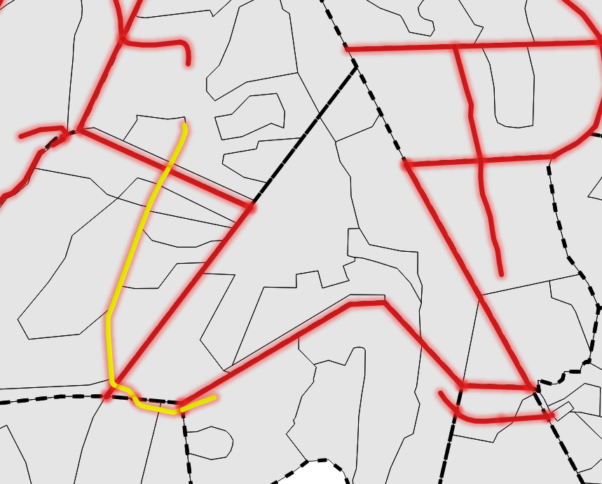

# 2b. \[INFO] Geometria przypisuje się do wielu adresów leśnych

W tej tabeli znajdują się obiekty geometryczne, dla których odnaleziono więcej niż jeden adres leśny. Najczęściej taka sytuacja występuje gdy w trakcie prac przy PUL wykonawca bazy wyrysuje obiekty liniowe (szczególnie z kodem obiektu LINIE) poprzez wiele oddziałów leśnych.&#x20;

Takie postępowanie zgodnie z Instrukcją Urządzania Lasu nie jest błędem, lecz może prowadzić do niewłaściwego przypisania adresów, niewłaściwego rozliczenia powierzchni tyldy w oddziale, etc.

Dlatego rozważ podział obiektu geometrycznego na krótsze odcinki, na granicach oddziałów i ponowne ich zaadresowanie.

<table><thead><tr><th width="213">Nazwa kolumny</th><th>Opis</th></tr></thead><tbody><tr><td>adresy_tyld</td><td>Adresy leśne tyld</td></tr><tr><td>kod_ob</td><td>Kod obiektu (rodzaj obiektu liniowego)</td></tr><tr><td>zlicz</td><td>Ilość wystąpień adresów leśnych</td></tr><tr><td>zlicz_oddzialy</td><td>Ilość wystąpień w unikalnych oddziałach (zobacz <a href="2c.-ostrzezenie-w-oddziale-do-obiektu-geometrycznego-przypisano-wiecej-adresow.md">tab. 2c</a>)</td></tr></tbody></table>

<figure><figcaption>
Podświetlona na żółto droga leśna biegnąca przez 5 oddziałów
</figcaption></figure>
