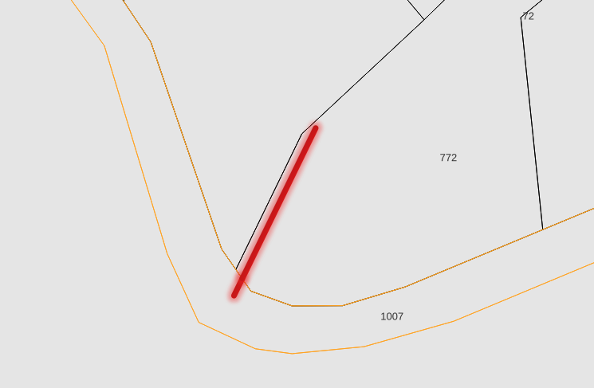

# 2c. \[OSTRZEZENIE] W oddziale do obiektu geometrycznego przypisano więcej adresów

Struktura tabeli jest identyczna jak w przypadku [tab. 2b](2b.-info-geometria-przypisuje-sie-do-wielu-adresow-lesnych.md), lecz następuje odfiltrowanie wyłącznie tych obiektów których wszystkie wystąpienia znajdują się w jednym oddziale leśnym.

Najczęściej sytuacja w której w jednym oddziale, do jednego obiektu geometrycznego zostaje przypisany więcej niż jeden adres leśny występuje jeśli istnieje granica działek lub użytków przez którą przechodzi obiekt liniowy.

<figure><figcaption>
Droga leśna wewnątrz oddziału przechodzi przez granicę działek ewidencyjnych
</figcaption></figure>

