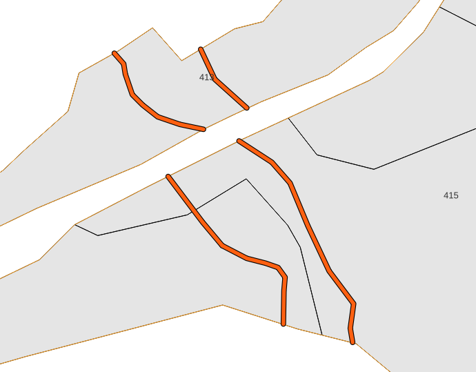

# 2d. \[INFO] W bazie do adresu leśnego tyldy przypisano więcej geometrii

Warstwa informacyjna, wskazująca przypisanie wielu obiektów geometrycznych do jednego adresu leśnego wewnątrz oddziału. Taka sytuacja występuje najczęściej jeśli _tylda_ rozdzielona jest wydzieleniem poligonowym drogi leśnej, albo gruntami obcymi.

| Nazwa kolumny | Opis                                                                    |
| ------------- | ----------------------------------------------------------------------- |
| zliczone      | Ilość obiektów geometrycznych przypisanych do jednego adresu leśnego    |
| id\_obiektow  | Identyfikatory obiektów z warstw a\_ciek\_lin, a\_kom\_lin,a\_line\_lin |
| adres\_tyldy  | Adres leśny tyldy                                                       |

<figure><figcaption>
Tyldy "przedzielone" gruntami obcymi
</figcaption></figure>
