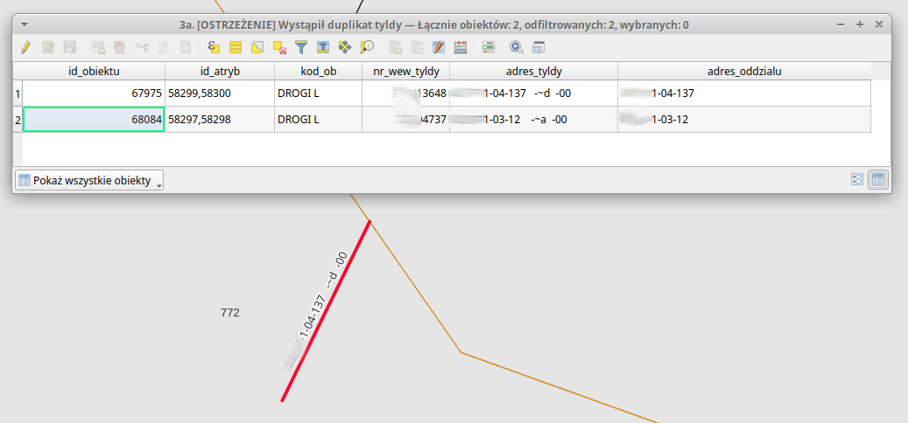

# 3a. \[OSTRZEŻENIE] Wystąpił duplikat tyldy

Jeśli temu samemu obiektowi geometrycznemu wewnątrz oddziału przypisano więcej niż jeden adres leśny, najczęściej jest to błąd spowodowany pracą w Edytorze. Po sprawdzeniu poprawności przypisania, usuń jeden z wpisów w SILP.&#x20;

&#x20;                           &#x20;

| Nazwa kolumny   | Opis                                                                                                                                                                                   |
| --------------- | -------------------------------------------------------------------------------------------------------------------------------------------------------------------------------------- |
| id\_obiektu     | Identyfikator obiektu w warstwach **a\_ciek\_lin, a\_kom\_lin, a\_line\_lin**                                                                                                          |
| id\_atryb       | Identyfikatory atrybutów z tabel **a\_ciek\_a, a\_kom\_a, a\_line\_a**                                                                                                                 |
| kod\_ob         | Kod obiektu - wskazanie w której z warstw znajduje się obiekt geometryczny, oraz rekordy atrybutowe                                                                                    |
| adres\_tyldy    | Adres leśny tyldy. W tym miejscu wykazywany jest tylko pierwszy z adresów przypisanych do geometrii - aby znaleźć pozostałe musisz skorzystać z tabel **a\_\***_**a** i **f\_arodes**_ |
| adres\_oddzialu | Adres leśny oddziału                                                                                                                                                                   |

<figure><figcaption>
Przykład zduplikowanej tyldy
</figcaption></figure>
