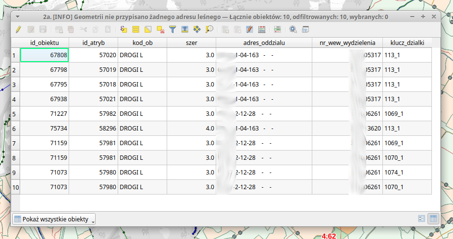

# 2a. \[INFO] Geometrii nie przypisano żadnego adresu leśnego

W tym etapie sprawdzane jest przypisanie adresów leśnych do obiektów geometrycznych. Jeśli algorytm nie znajdzie informacji o przypisaniu arodes\_int\_num a więc adresu leśnego tyldy, wstawi obiekt do tej tabeli. Pozwala to na sprawdzenie czy nie pominięto któregoś z obiektów trakcie adresowania wydzieleń \~.

W niektórych sytuacjach (np. przebieg linii energetycznej wzdłuż drogi leśnej) występowanie obietu w tej tabeli nie będzie błędem.

| Nazwa kolumny        | Opis                                                                                                                |
| -------------------- | ------------------------------------------------------------------------------------------------------------------- |
| id\_obiektu          | Identyfikator obiektu w warstwach a\_ciek\_lin, a\_kom\_lin, a\_line\_lin (odpowiednio id\_wody, id\_kom, id\_lin). |
| id\_atryb            | Identyfikator atrybutu z w/w warstw                                                                                 |
| kod\_ob              | Kod obiektu w w/w warstwach                                                                                         |
| szer                 | Szerokość podana w warstwie                                                                                         |
| adres\_oddzialu      | Adres oddziału w którym znajduje się ta geometria                                                                   |
| nr\_wew\_wydzielenia | Arodes\_int\_num wydzielenia w którym znajduje się ta geometria liniowa                                             |
| klucz\_dzialki       | Klucz działki na której leży ten obiekt liniowy                                                                     |

<figure><figcaption></figcaption></figure>
