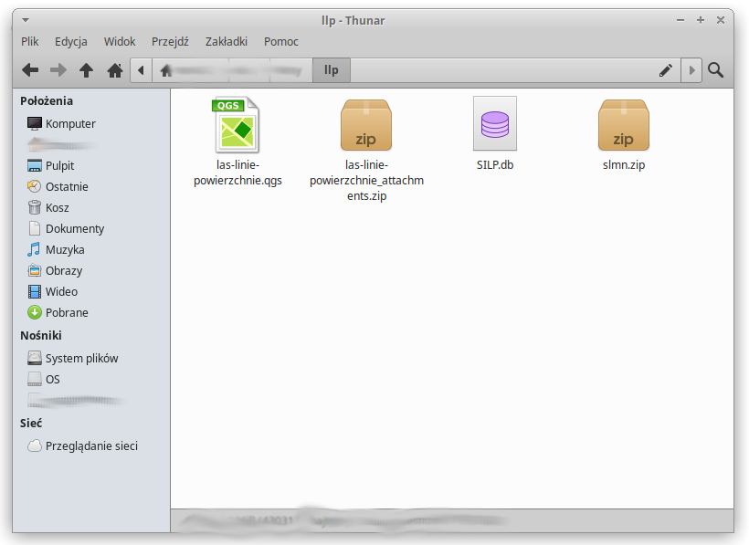

# Przygotowanie do pracy

Projekt i model wymagają dostępu do danych SLMN i SILP. Aby umożliwić pracę na dowolnym komputerze z oprogramowaniem QGIS w wersji co najmniej 3.28 wykorzystujemy funkcjonalności eksportu paczek danych zarówno SLMN jak i paczki dla mLas Inżyniera.

Po pobraniu tego repozytorium, znajdziesz cztery podstawowe elementy. Plik projektu QGIS las-linie-powierzchnie.qgs, zbiór zip z danymi pomocnicznymi projektu (style, reguły, modele), plik SILP.db, oraz slmn.zip.

Przed przystąpieniem do pracy przygotuj swoje paczki danych, a następnie umieść spakowany zbiór warstw SLMN w miejscu pliku slmn.zip (nadpisz istniejący zbiór przykładowy).

Również dane SILP pozyskasz z spakowanego pliku zip o nazwie nadlesnictwo\_data.zip - wejdź do katalogu i wybierz tylko SILP.db - przenieś go do katalogu projektu.

<figure><figcaption>
Katalog projektu po pobraniu i przygotowaniu do pracy.
</figcaption></figure>

