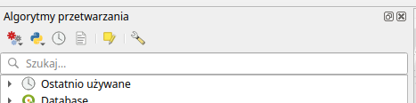
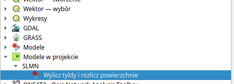

# Pierwsze uruchomienie

Po uruchomieniu QGIS i wczytaniu projektu las-linie-powierzchnie.qgs otwórz panel Algorytmy Processingu (z menu 'Processing' lub skrótem klawiszowym 'Ctrl+Alt+T'

<figure><figcaption></figcaption></figure>

Następnie odszukaj grupę Modele w projekcie i podgrupę SLMN. Dwukrotne kliknięcie w model ''Wylicz tyldy i rozlicz powierzchnie''

<figure><figcaption>
Model gotowy do pracy
</figcaption></figure>
